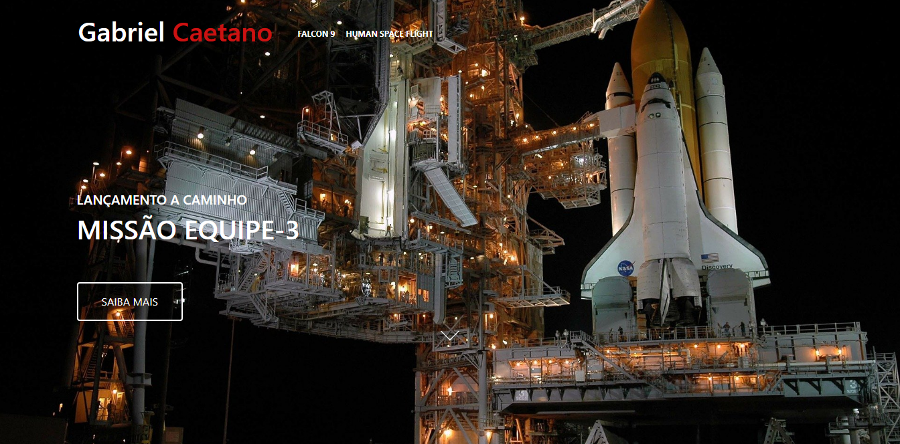

<h1 align="center"> OneBitX </h1>

Exercicio desenvolvido durante uma aula do curso Programador FullStack JavaScript da OneBitCode, onde a ideia é replicar algumas das páginas do site da SpaceX.  

  <a href="#-tecnologias">Tecnologias</a>&nbsp;&nbsp;&nbsp;|&nbsp;&nbsp;&nbsp;
  <a href="#-projeto">Projeto</a>&nbsp;&nbsp;&nbsp;

 

  

## 🚀 Tecnologias

Esse projeto foi desenvolvido com as seguintes tecnologias:

- HTML e CSS
- Bootstrap
- Sass
- Aos animation

## 💻 Projeto

Página Home, Falcon9 e HumanSpaceFlight do site da SpaceX, para exercitar o uso do bootstrap junto com o sass, e também adicionado a biblioteca aos-animation para fazer as animações dos textos.

## [Ir para o site 🌐](https://gabrielcaetano-onebitx.vercel.app/)